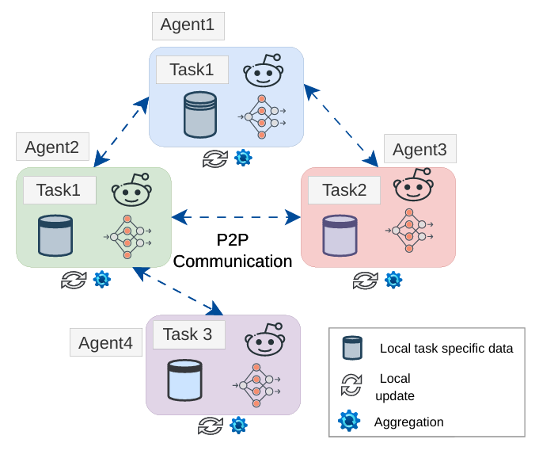
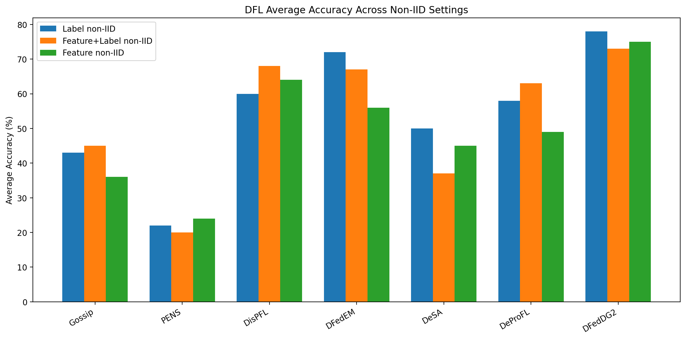

# DFedDG2 — Distribution Guided Gossip Based Generalizable and Communication Efficient Decentralized Federated Learning


This is the official pytorch implementation of the paper [DFedDG2](https://ieeexplore.ieee.org/document/11408173). In collaborative intelligence (e.g. multiple IoT devices, robots or AI agents sharing knowledge), peers can both guide and misguide the learning process as they perform different local tasks. A central server to orchestrate this knowledge sharing and learning (traditional FL) becomes a communication bottleneck, a single point of failure, and a security risk. But removing the centralized orchestration and non-iid data, changes the learning dynamics. So, the challenge of drift increases. Our solution tackles client drift that happens because of collaboration of agents/clients/robots that are assigned different tasks.








Benefits:
1. Model heterogeneity: DFedDG2 is applicable to multi-agent or robotic systems where clients may use different local deep learning models due to device-level resource constraints and heterogeneous hardware capabilities.
2. Diverse non-IID tasks: DFedDG2 consistently outperforms contemporary baselines across a wide range of non-IID settings, including both data and task heterogeneity across clients.

Technically we,
1. Modeled knowledge sharing on the hypersphere using direction-sensitive vMF distributions (implicitly mixture of vMF).
2. Designed a distribution-aware gossip mechanism, modelling uncertainty explicitly.
3. Achieved a theoretical sublinear convergence rate and a strictly smaller consensus error than uniform gossip.

---

## Table of Contents

- [Method](#method)
- [Installation](#installation)
- [Dataset Setup](#dataset-setup)
- [Quick Start](#quick-start)
- [Arguments Reference](#arguments-reference)
- [Topology Options](#topology-options)
- [Loss Functions](#loss-functions)
- [Output and Results](#output-and-results)
- [Project Structure](#project-structure)

---
## Method

### vMF Gossip Communication

Each round proceeds in five phases:

| Phase | Description |
|-------|-------------|
| 1. Dynamic Topology | Resample an Erdős–Rényi graph (p=0.5) per round and Sinkhorn-balance the mixing matrix |
| 2. Local Update | Each client trains for `local_epochs` using CE + CompLoss + DisLoss aligning local knowledge to global knowledge|
| 3. Weight Computation | For each client, compute vMF log-likelihoods of local features under each neighbor's embedding distribution; softmax-normalize to compute gossip weights |
| 4. Aggregation | Collect weighted neighbor aggregated embeddings and dispersion; estimate per-class vMF concentration $\hat{\kappa}$ |
| 5. Post-Gossip Injection | Commit aggregated embeddings to `global_protos`; inject into DisLoss EMA buffer |

### Loss Variants (`--decood_loss_code`)

| Code | Formula | Notes |
|------|---------|-------|
| `EC` | CE + $\lambda$·CompLoss | **Recommended default** |
| `CD` | CompLoss + DisLoss | No cross-entropy |
| `ECD` | CE + $\lambda$·(CompLoss + DisLoss) | All components |

---

## Installation

```bash
conda env create -f environment.yml
conda activate DFedDG2
```

Requires CUDA 12.6. For a different CUDA version, edit `environment.yml` and replace `+cu126` with the appropriate suffix (e.g. `+cu118`) or use CPU-only builds.

---

## Dataset Setup

All datasets should be placed in `../../data/` relative to the repo root (two levels up). This path is set via `--data_dir`.

### Directory Layout

```
../../data/
├── office/          # Office-10 dataset
│   ├── amazon/
│   ├── dslr/
│   └── webcam/
├── digit-five/      # Digits-5 dataset
│   ├── mnist/
│   ├── usps/
│   ├── svhn/
│   ├── synth/
│   └── mnistm/
└── DomainNet/       # DomainNet dataset
    ├── clipart/
    ├── infograph/
    ├── painting/
    ├── quickdraw/
    ├── real/
    └── sketch/
```

### Download Links

| Dataset |  Download |
|---------|----------|
| **Office-10** (Office-31 subset) | [Office-31](https://drive.google.com/drive/folders/1SJLhRiXbAwNpbgFXIg2KQRBZA5ZYQ62W?usp=share_link) |
| **Digits-5** |  [MNIST-M](https://github.com/pumpikano/tf-dann), [SVHN](http://ufldl.stanford.edu/housenumbers/), [USPS](https://git-disl.github.io/GTDLBench/datasets/usps_dataset/), [SynthDigits](https://rodsmith.nz/synthetic-digits/), [Digits5](https://drive.google.com/file/d/1A4RJOFj4BJkmliiEL7g9WzNIDUHLxfmm/view) |
| **DomainNet** | [DomainNet](https://drive.google.com/drive/folders/1SJLhRiXbAwNpbgFXIg2KQRBZA5ZYQ62W?usp=share_link) |

After downloading, update `--data_dir` in the script if your path differs from `../../data/`.

---

## Quick Start

### Windows (PowerShell)

Edit the config section at the top of `scripts/run_exp_deccon.ps1`, then run:

```powershell
cd DFedDG2
.\scripts\run_exp_deccon.ps1
```

Key config variables in the script:

```powershell
$dataset        = "office"         # "office" | "digit" | "domainnet"
$num_clients    = 4                # 4 for office, 5 for digit, 20 for domainnet
$num_classes    = 10               # 10 for office/digit, 10/345 for domainnet
$feature_iid    = 1                # 1 = identical feature distribution per client
$label_iid      = 0                # 0 = Dirichlet non-IID labels, 1 = IID labels
$lr             = 0.1              # 0.3 recommended for digits
$num_rounds     = 50
$backbone       = "mobilenet_proj" # "resnet18_proj" | "resnet34_proj" |ViT
$data_dir       = "../../data/"
```

### Linux / Bash

```bash
cd DFedDG2
bash scripts/run_exp_deccon.sh
```

### Manual Command

```bash
python run_trainer_dfeddg2.py \
  --algorithm DecoodVMF \
  --comm comm_vmf_gossip \
  --dataset office \
  --num_clients 4 \
  --num_classes 10 \
  --num_rounds 20 \
  --num_trials 3 \
  --feature_iid 1 \
  --label_iid 0 \
  --dist dir \
  --lr 0.1 \
  --local_epochs 3 \
  --local_bs 32 \
  --backbone mobilenet_proj \
  --feat_dim 512 \
  --decood_loss_code EC \
  --tau 0.1 \
  --weighted_adj_mat 1 \
  --dynamic_topo 1 \
  --normalize True \
  --data_dir ../../data/ \
  --save_folder_name results/ \
  --params_dir params/
```

### Per-Dataset Recommended Settings

| Dataset | `--num_clients` | `--num_classes` | `--lr` | `--backbone` |
|---------|----------------|----------------|--------|--------------|
| `office` | 4 | 10 | 0.1 | `mobilenet_proj` |
| `digit` | 5 | 10 | 0.3 | `mobilenet_proj` |
| `domainnet` | 5/50/100 | 10/345 | 0.01 | `mobilenet_proj`, `resnet`, `ViT` |

---

## Arguments Reference

### General

| Argument | Default | Description |
|----------|---------|-------------|
| `--seed` | `1234` | Global random seed (controls all sources of randomness) |
| `--algorithm` | `FedProto` | Algorithm: `DecoodVMF` |
| `--comm` | `vanilla_proto` | Communication method: `comm_vmf_gossip` |
| `--num_trials` | `3` | Number of independent trials |
| `--num_rounds` | `20` | Communication rounds per trial |
| `--num_clients` | `20` | Number of federated clients |
| `--device` | auto | Device override: `cuda` or `cpu` |
| `--gpu` | `0` | GPU index |
| `--no_cuda` | `False` | Disable CUDA even if available |

### Dataset

| Argument | Default | Description |
|----------|---------|-------------|
| `--dataset` | `digit` | Dataset: `office` \| `digit` \| `domainnet` |
| `--num_classes` | `10` | Number of classes |
| `--feature_iid` | `0` | `1` = IID features (same domain), `0` = non-IID (cross-domain) |
| `--label_iid` | `1` | `1` = IID labels, `0` = Dirichlet non-IID labels |
| `--dist` | `iid` | Distribution type: `dir` (Dirichlet) |
| `--alpha` | `1.0` | Dirichlet concentration (lower = more heterogeneous) |
| `--data_dir` | `../FedPCL/data/` | Root data directory |

### Model

| Argument | Default | Description |
|----------|---------|-------------|
| `--backbone` | `mobilenet_proj` | Backbone: `mobilenet_proj` \| `mobilenet` \| `resnet18_proj` \| `resnet34_proj` \| `CNNMnist` |
| `--feat_dim` | `512` | Feature embedding dimension |
| `--normalize` | `True` | L2-normalize embeddings |

### Training

| Argument | Default | Description |
|----------|---------|-------------|
| `--lr` | `0.1` | Learning rate |
| `--local_epochs` | `3` | Local epochs per round |
| `--local_bs` | `32` | Local batch size |
| `--momentum` | `0.9` | SGD momentum |
| `--weight_decay` | `1e-4` | Weight decay |
| `--learning_rate_decay` | `0.9` | LR decay factor applied per round |
| `--use_imb_loss` | `True` | Use class-imbalance-aware loss weighting |

### DECOOD Loss

| Argument | Default | Description |
|----------|---------|-------------|
| `--decood_loss_code` | `CD` | Loss variant: `EC` \| `CD` \| `ECD` |
| `--LAMBDA` | `0.2` | Weight $\lambda$ for DECOOD loss terms |
| `--tau` | `0.1` | Temperature for contrastive losses |
| `--proto_m` | `0.5` | EMA momentum for prototype updates in DisLoss |
| `--test_on_cosine` | `False` | Use cosine similarity for prototype-based inference (vs. MSE) |
| `--sel_on_kappa` | `True` | Select prototypes weighted by vMF concentration $\hat{\kappa}$ |

### Topology

| Argument | Default | Description |
|----------|---------|-------------|
| `--topo` | `sparse` | Base topology: `ring` \| `sparse` \| `fc` |
| `--dynamic_topo` | `1` | `1` = resample graph each round, `0` = fixed topology |
| `--sparse_neighbors` | `5` | Number of neighbors in sparse topology |
| `--weighted_adj_mat` | `1` | Weight adjacency matrix by local class sample counts |

### Output

| Argument | Default | Description |
|----------|---------|-------------|
| `--save_folder_name` | `results/` | Directory for accuracy matrices and round histories |
| `--params_dir` | `params/` | Directory for per-client prototype/model saves |

---

## Topology Options

| Topology | `--topo` | `--dynamic_topo` | Description |
|----------|----------|-----------------|-------------|
| Ring | `ring` | `0` | Fixed circular chain |
| Sparse | `sparse` | `0` | Fixed Erdős–Rényi graph |
| Fully Connected | `fc` | `0` | All-to-all communication |
| Dynamic | any | `1` | Resample Erdős–Rényi (p=0.5) each round |

With `--weighted_adj_mat 1`, edge weights are proportional to the local class distribution similarity between neighbors, encouraging data-heterogeneity-aware communication.

---

## Output and Results

After training, the following files are written:

| File | Location | Contents |
|------|----------|----------|
| `*.pkl` | `results/` | `[num_trials × num_clients]` accuracy matrix |
| `*.pkl` | `results/` | Per-round average accuracy history per trial |
| `*.pkl` | `params/` | Client N's local prototypes, global prototypes, accuracy history |
| `*.log` | `logs/experiments/` | Full training log with timestamps |

Filenames encode the full experiment config, e.g.:
```
acc_mtx_4_office_DecoodVMF_feat_iid_1_label_iid_0_iid_dir_COMM_comm_vmf_gossip.pkl
```

Final console / log output reports:
- Per-client mean ± std accuracy across trials
- Unweighted average accuracy (equal weight per client)
- Weighted average accuracy (weighted by each client's test set size)

---

## Project Structure

```
DFedDG2/
├── run_trainer_dfeddg2.py      # Main entry point
├── client_manager.py           # Client factory
├── environment.yml             # Conda environment (Python 3.12, PyTorch 2.10, CUDA 12.6)
│
├── clients/
│   └── client_decood_vmf.py   # ClientDecoodVMF — local training + prototype logic
│
├── comm_utils/
│   ├── comm_vmf_gossip.py     # vMF gossip communication loop
│   ├── topology_manager.py    # Adjacency matrix construction
│   ├── decentralized.py       # Erdős–Rényi graph + mixing matrix utilities
│   ├── comm_gossip.py         # Standard gossip (reference implementation)
│   └── mst.py                 # Minimum spanning tree topology
│
├── models/
│   ├── model_manager.py       # Model factory (get_model)
│   └── models.py              # BaseHeadSplit, MobileNet variants, ResNet variants
│
├── utils/
│   ├── losses_decood.py       # CompLoss, DisLoss, SupConLoss
│   ├── utils_proto.py         # evaluate_clients, prototype utilities
│   ├── utils.py               # Data preparation, neighbour selection
│   └── optimizers.py          # Custom optimizers
│
├── lib/
│   ├── pcl_utils.py           # Dataset loaders (digits, office, domainnet)
│   └── data_utils.py          # DatasetSplit utility
│
├── data/                      # Precomputed adjacency matrices
├── results/                   # Accuracy matrices (auto-created at runtime)
├── params/                    # Client model/proto saves (auto-created at runtime)
└── scripts/
    ├── run_exp_deccon.ps1     # PowerShell launch script (Windows)
    └── run_exp_deccon.sh      # Bash launch script (Linux)
```

---

## Citation
If you find DFedDG2 helpful, please consider citing our paper:

```
@ARTICLE{11408173,
  author={Pal, Biprodip and Funiak, Stano and Liu, Jiajun and Moghadam, Peyman and Islam, Md. Saiful and Liew, Alan Wee-Chung},
  journal={IEEE Internet of Things Journal}, 
  title={DFedDG2: Distribution Guided Gossip Based Generalizable and Communication Efficient Decentralized Federated Learning}, 
  year={2026},
  volume={},
  number={},
  pages={1-1},
  keywords={Data models;Servers;Computational modeling;Uncertainty;Federated learning;Training;Peer-to-peer computing;Topology;Prototypes;Convergence;Decentralized federated learning;Gossip;Contrastive learning;Non-IID;Peer-to-Peer},
  doi={10.1109/JIOT.2026.3667408}}
```
